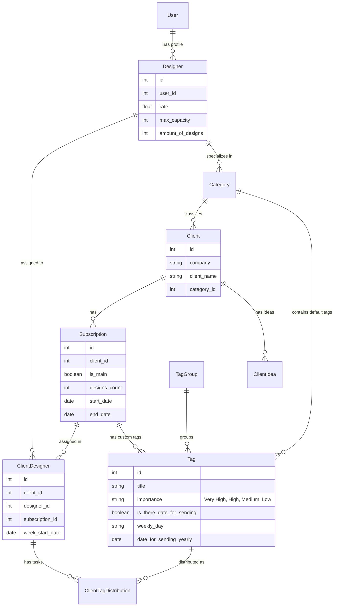
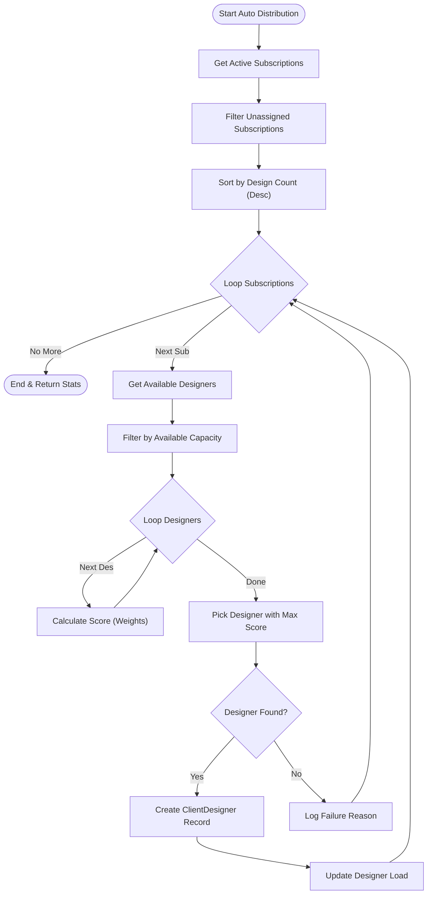
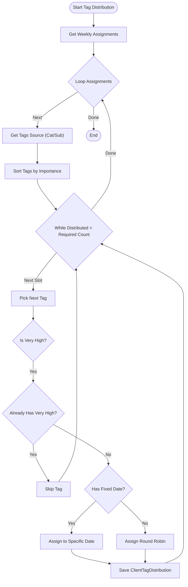

# وثيقة متطلبات النظام (System Requirements Specification)

## 1. نظرة عامة (Project Overview)
المطلوب بناء "نظام إدارة وتوزيع المصممين" (Designer Distribution System). هو نظام برمجي يهدف إلى أتمتة عملية تعيين المصممين للعملاء وتوزيع مهام التصميم اليومية بناءً على خوارزميات ذكية تضمن الكفاءة والعدالة.

### المكدس التقني المطلوب (Required Tech Stack)
يجب بناء النظام باستخدام التقنيات التالية حصراً:
*   **Backend:** [NestJS](https://nestjs.com/) (Node.js Framework).
*   **Database:** PostgreSQL أو MySQL (مع استخدام **Prisma ORM**).
*   **Frontend:** React.js (أو إطار عمل مبني عليه مثل Next.js أو Refine).
*   **Language:** TypeScript (Full-stack).

---

## 2. هيكلية البيانات (Data Architecture)

### مخطط قاعدة البيانات (ER Diagram)
يوضح المخطط التالي الكيانات التي يجب إنشاؤها في قاعدة البيانات والعلاقات بينها.

### تعريف الكيانات (Entities Definition)
1.  **Client (العميل):** الجهة الطالبة للخدمة.
2.  **Designer (المصمم):** الموظف المنفذ. يجب تخزين سعته القصوى (`max_capacity`) وتقييم أدائه (`rate`).
3.  **Subscription (الاشتراك):** يحدد عدد التصاميم المطلوبة أسبوعياً.
    *   **نوعان:** "أساسي" (Main) و "ثانوي" (Secondary).
4.  **ClientDesigner (التعيين):** سجل يربط اشتراكاً معيناً بمصمم معين لفترة أسبوعية محددة.
5.  **Tag (المهمة/الفكرة):** نوع التصميم المطلوب تنفيذه (مثلاً: "بوست انستقرام"). له أهمية وتوقيت.

---

## 3. منطق العمل والخوارزميات (Core Business Logic)

يجب تنفيذ الخوارزميات التالية في الـ Backend (Services) لضمان عمل النظام بشكل آلي.

### أ. خوارزمية توزيع المصممين (Auto-Distribution Algorithm)
**الهدف:** تعيين مصمم لكل اشتراك نشط في بداية الأسبوع بشكل تلقائي.

**معايير المفاضلة (Scoring System):**
عند اختيار مصمم لاشتراك معين، يتم حساب نقاط لكل مصمم متاح بناءً على:
1.  **التخصص (30%):** هل تخصص المصمم يطابق تصنيف العميل؟
2.  **توازن السعة (30%):** الأولوية للمصمم الذي لديه فراغ أكبر (Current Load < Max Capacity).
3.  **التقييم (30%):** الأولوية للمصمم ذو التقييم الأعلى.
4.  **الاستمرارية (15%):** هل عمل المصمم مع هذا العميل في الأسبوع السابق؟ (للحفاظ على سياق العمل).
5.  **الخبرة (10%):** الاشتراكات ذات العدد الكبير من التصاميم تتطلب مصممين ذوي خبرة عالية.

### ب. خوارزمية توزيع المهام (Tag Distribution Algorithm)
**الهدف:** بعد تعيين المصممين، يتم توزيع "التاقات" (أفكار التصاميم) على أيام الأسبوع.

**قواعد التوزيع:**
1.  **مصدر التاقات:**
    *   إذا كان الاشتراك "أساسي": نأخذ التاقات من تصنيف العميل (`Category Tags`).
    *   إذا كان الاشتراك "ثانوي": نأخذ التاقات المربوطة بالاشتراك نفسه (`Subscription Tags`).
2.  **الأولوية:** يتم توزيع التاقات ذات الأهمية `Very High` أولاً، ثم `High`، وهكذا.
3.  **قيد التكرار (للاشتراك الأساسي):**
    *   يمنع تكرار التاقات `Very High` (مسموح مرة واحدة فقط).
    *   يسمح بتكرار `Medium` و `Low` لملء الجدول إذا لزم الأمر.
4.  **التوقيت:**
    *   التاقات المرتبطة بيوم محدد (مثلاً "الجمعة") أو تاريخ سنوي (مثلاً "1 يناير") يجب وضعها في تاريخها بدقة.
    *   باقي التاقات توزع بالتتابع (Round Robin) على أيام العمل.

---

## 4. متطلبات لوحة التحكم (Admin Panel Requirements)
المطلوب بناء واجهة ويب (Dashboard) تمكن الإدارة من:

1.  **إدارة الموارد (CRUD):** إضافة وتعديل وحذف (العملاء، المصممين، الاشتراكات، التاقات).
2.  **شاشة توزيع المصممين:**
    *   عرض جدول التوزيع للأسبوع الحالي.
    *   زر لتشغيل "التوزيع التلقائي".
    *   إمكانية التعديل اليدوي (سحب وإفلات أو قائمة منسدلة لتغيير المصمم).
3.  **شاشة جدول المهام:**
    *   عرض تقويم (Calendar View) لكل عميل يوضح التاقات الموزعة على الأيام.
    *   زر لتشغيل "توزيع التاقات".

## 5. ملاحظات التطوير (Development Notes)
*   يجب أن يكون النظام قابلاً للتوسع (Scalable) لدعم آلاف العملاء.
*   يجب كتابة **Unit Tests** للخوارزميات المذكورة أعلاه لضمان دقة النتائج.
*   يفضل جعل "أوزان التوزيع" (Weights) قابلة للتعديل من لوحة التحكم (Configurable) وليس ثابتة في الكود.
